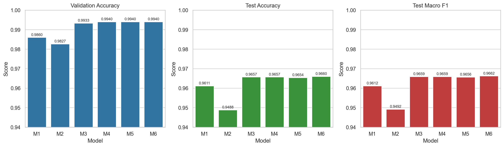
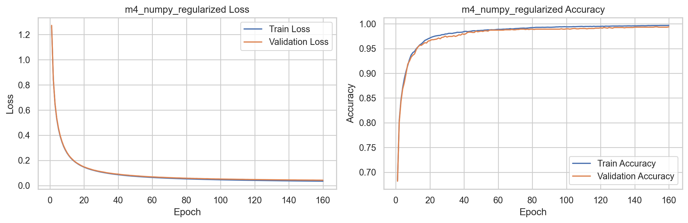
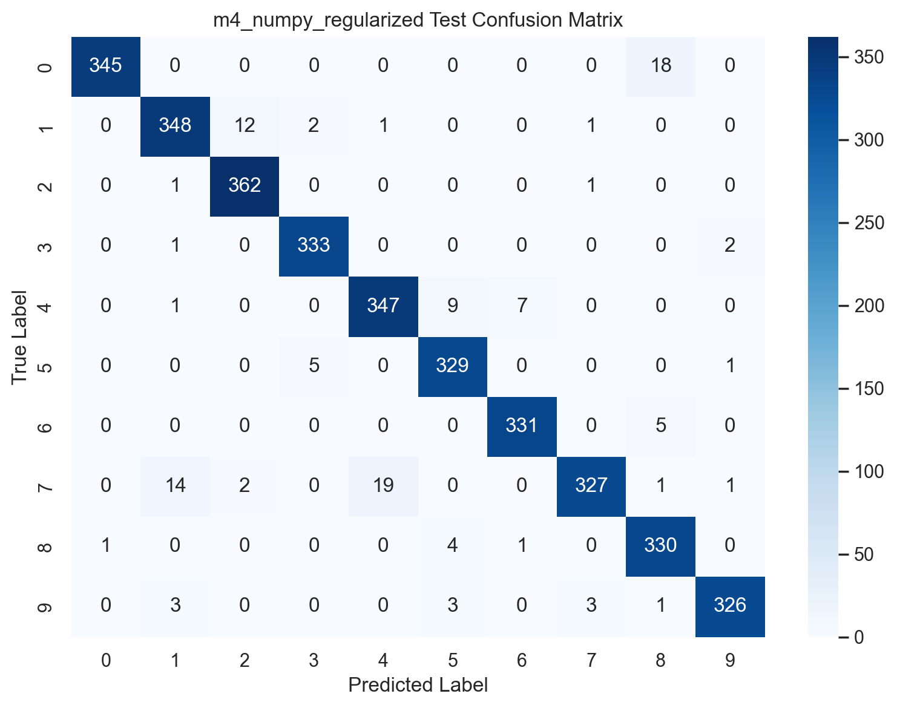

# Handwritten Digit Classification with Multilayer Perceptrons

## Introduction

Handwritten digit recognition is a standard multiclass classification problem and remains a useful benchmark for evaluating neural-network behavior under controlled conditions. In this study, multilayer perceptron (MLP) models were trained and compared on the UCI Pendigits dataset, which represents handwritten digits with compact numerical descriptors rather than raw pixel grids. The problem is therefore well suited to studying the effect of model depth, preprocessing, and regularization on a structured multiclass task.

The main objective of the study was to start from a simple baseline network and then improve it step by step while keeping the experimental setting reproducible. In addition to a manual NumPy implementation, the same improved architecture was also reproduced with `scikit-learn` and PyTorch in order to verify whether similar results could be obtained across different implementations.

The study was guided by three questions. First, how strong is a shallow MLP baseline on Pendigits? Second, does a deeper architecture improve generalization compared with the baseline? Third, if the same experimental design is reproduced in library-based implementations, do the results remain consistent enough to support the correctness of the manual implementation?

## Methods

The experiments were conducted on the UCI Pendigits dataset. The dataset contains 7,494 samples in the official training split and 3,498 samples in the official test split. Each sample has 16 input features and belongs to one of 10 digit classes (`0-9`). The classes are close to balanced and the dataset contains no missing values. The official test split was preserved for final evaluation. The official training split was further divided into a training subset of 5,995 samples and a validation subset of 1,499 samples by using stratified sampling with a fixed random seed of 42.

Two preprocessing settings were considered. The first used the original input features directly. The second applied z-score standardization. In the standardized setting, the mean and standard deviation were computed only on the training subset and then reused for the validation and test subsets. This prevented leakage from validation or test data into the training pipeline.

Six models were evaluated:

| Model | Implementation | Architecture | Main Purpose |
| --- | --- | --- | --- |
| M1 | NumPy | 16 -> 32 -> 10 | Baseline model with raw features |
| M2 | NumPy | 16 -> 32 -> 10 | Same baseline with standardized inputs |
| M3 | NumPy | 16 -> 64 -> 32 -> 10 | Deeper model with increased capacity |
| M4 | NumPy | 16 -> 64 -> 32 -> 10 | Deeper model with L2 regularization |
| M5 | scikit-learn | 16 -> 64 -> 32 -> 10 | Replica of M4 with `MLPClassifier` |
| M6 | PyTorch | 16 -> 64 -> 32 -> 10 | Replica of M4 with PyTorch |

All models were trained as multiclass neural networks with stochastic gradient descent (SGD). Hidden layers used ReLU activations. The final layer produced softmax-style multiclass probabilities and training used multiclass cross-entropy loss. He-style random initialization was used for the network weights. The common hyperparameters were a learning rate of 0.01, batch size of 64, and random seed of 42. Models M1 and M2 were trained for 120 epochs, while M3 through M6 were trained for 160 epochs. L2 regularization with coefficient `1e-4` was applied in M4, M5, and M6.

To keep the comparison fair, the same dataset split was used across all experiments. For the stronger architecture, the NumPy, `scikit-learn`, and PyTorch versions were configured to be as close as possible in terms of architecture, optimization algorithm, and training settings. Performance was measured with accuracy, precision, recall, macro F1-score, confusion matrices, and training-history plots. The model selection rule was defined before examining the test set: the preferred model was the one with the highest validation accuracy, with ties broken by lower `n_steps`.

## Results

The overall pattern of results is clear. The shallow baseline already achieved high performance, which suggests that Pendigits is a relatively friendly dataset for MLP-based classification. However, the deeper architecture still improved the validation and test metrics. Standardization alone did not improve the shallow model and in fact reduced its performance slightly, which indicates that preprocessing was not automatically beneficial in this feature space.

| Model | Validation Accuracy | Test Accuracy | Test Macro F1 |
| --- | --- | --- | --- |
| M1 NumPy raw baseline | 0.985991 | 0.961121 | 0.961161 |
| M2 NumPy standardized | 0.982655 | 0.948828 | 0.949159 |
| M3 NumPy deeper | 0.993329 | 0.965695 | 0.965915 |
| M4 NumPy regularized | 0.993996 | 0.965695 | 0.965915 |
| M5 scikit-learn replica | 0.993996 | 0.965409 | 0.965646 |
| M6 PyTorch replica | 0.993996 | 0.965981 | 0.966201 |

The comparison across all models is summarized in the following figure. The plot shows that the deeper models formed a clear top group, while the shallow standardized baseline remained the weakest variant.

The difference between the best-performing models is small in absolute percentage terms, but this is expected when the baseline already performs strongly and the dataset is not extremely difficult. The important result is the directional trend: moving from the shallow baseline to the deeper architecture reduced the number of mistakes, while adding L2 regularization maintained or slightly improved validation performance. According to the predefined selection rule, M4 was selected as the best manual model because it achieved the highest validation accuracy among the manual implementations. Although M6 obtained the best test accuracy overall, the difference was marginal and the final selection was not based on the test split.

The training history of the selected manual model (M4) shows stable convergence. The training and validation curves remain close to one another for most of the training process, which suggests that severe overfitting did not occur.

The confusion matrix of M4 further shows that most digits were classified correctly and that the remaining errors were concentrated in a few visually similar digit groups. The most noticeable confusions were between 7 and 1, 7 and 4, 0 and 8, and 4 with 5 or 6.

These observations support two conclusions. First, the deeper architecture was useful because it improved representation capacity without causing a large generalization gap. Second, the close agreement among M4, M5, and M6 suggests that the manual NumPy implementation is behaving consistently with the library-based replicas.

## Discussion

The results indicate that a simple MLP is already highly effective for Pendigits, but the deeper architecture provides a measurable and defensible improvement. The gain from M1 to M3 suggests that the baseline still had some remaining bias and that increasing model depth helped the network represent more complex class boundaries. The small improvement from M3 to M4 further suggests that regularization was beneficial, although the effect was modest because overfitting was not severe to begin with.

An important outcome of the experiments is that standardization did not improve the shallow network. This is a meaningful result rather than a failure. Pendigits features are already bounded in the `0-100` range, so the input space is more controlled than in many raw-feature problems. Under such conditions, additional scaling does not necessarily produce better optimization behavior. This highlights the importance of testing preprocessing decisions empirically instead of assuming that they will always help.

The similarity of the results across NumPy, `scikit-learn`, and PyTorch is also important. Because the three implementations of the stronger model achieved nearly identical validation performance, the manual implementation gains credibility. In practical terms, this consistency means that the main conclusions of the study are not artifacts of a single framework.

Several extensions could be explored in future work. The current study could be strengthened by testing dropout, batch normalization, learning-rate schedules, early stopping, or a broader hyperparameter search. It would also be interesting to compare these tabular-feature results with models trained on richer trajectory-based or image-based digit representations. Such extensions would help determine whether the current performance level is mainly limited by the model architecture or by the compact feature representation of the dataset.
