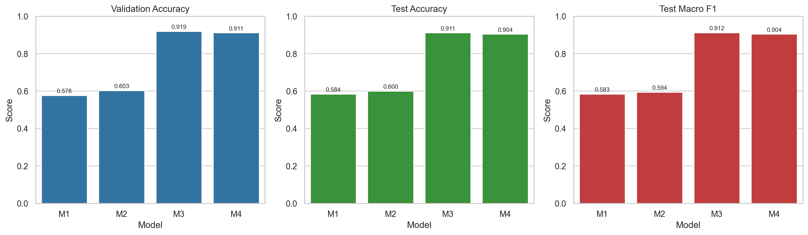
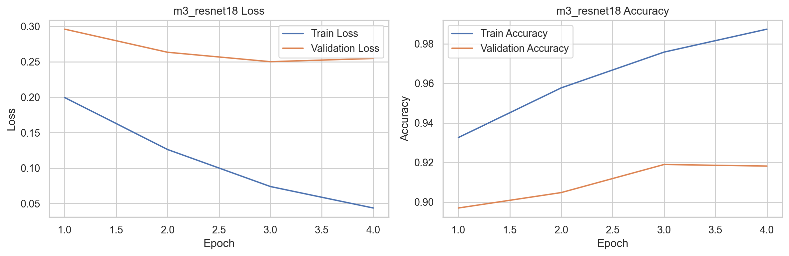
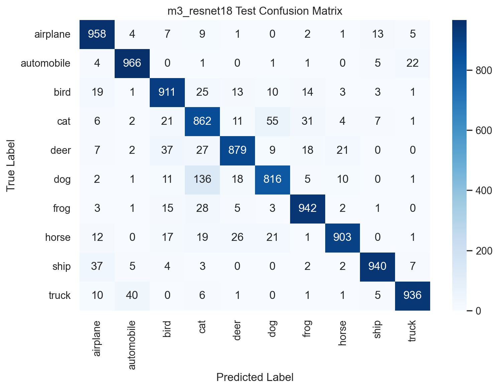
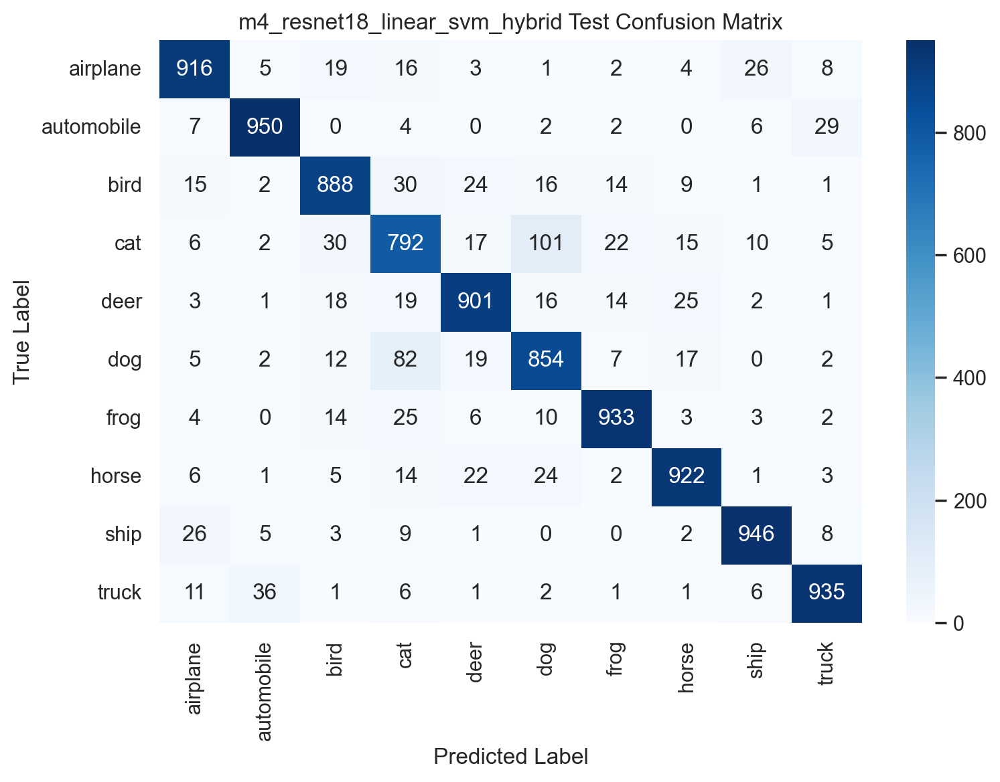

# Introduction

This project studies image classification with convolutional neural networks on the CIFAR-10 dataset. CIFAR-10 contains 60,000 RGB images of size `32 x 32` distributed across 10 balanced classes: airplane, automobile, bird, cat, deer, dog, frog, horse, ship, and truck. The goal was to compare a hand-written baseline CNN, an improved version of the same CNN, a standard literature architecture from `torchvision`, and a hybrid pipeline that uses CNN features with a classical machine learning classifier.

The project focuses on three practical questions. First, how far can a shallow LeNet-like CNN go on CIFAR-10? Second, does adding regularizing and stabilizing layers such as batch normalization and dropout improve that shallow baseline when the core convolutional hyperparameters are held fixed? Third, when a stronger pretrained CNN is available, is it better to use the full network end to end or to reuse it as a feature extractor and train a linear classifier on top of the extracted features?

# Methods

The experiments used CIFAR-10 with the official 50,000-image training split and 10,000-image test split. The official training split was divided into `45,000` training images and `5,000` validation images with a stratified split and a fixed seed of `42`. The same validation and test sets were used for every experiment. This keeps the comparisons fair and makes the selection rule consistent across models.

Two preprocessing pipelines were used. The custom CNNs operated on the native `32 x 32` images with random crop, horizontal flip, tensor conversion, and normalization using CIFAR-10 statistics. The pretrained ResNet18 and the hybrid model used resized `224 x 224` inputs, horizontal flip during training, and ImageNet normalization to match the pretrained backbone. All trainable CNNs used `CrossEntropyLoss`, stochastic gradient descent with momentum `0.9`, and deterministic seeding.

The model architectures were:

| Model | Architecture | Main Difference |
| --- | --- | --- |
| `M1` | `Conv(3,6,5) -> ReLU -> AvgPool -> Conv(6,16,5) -> ReLU -> AvgPool -> FC(400,120) -> FC(120,84) -> FC(84,10)` | Explicit LeNet-like baseline |
| `M2` | Same convolutional and fully connected dimensions as `M1`, with `BatchNorm2d` after each convolution and `Dropout(0.2, 0.3)` in the classifier | Same core hyperparameters, improved regularization and stabilization |
| `M3` | `torchvision` `ResNet18` with ImageNet weights, final layer replaced for 10 classes, only `layer4` and `fc` unfrozen | Standard literature CNN with partial fine-tuning |
| `M4` | `M3` as a fixed feature extractor producing 512-dimensional features, followed by `StandardScaler + LinearSVC` | Hybrid CNN feature extractor plus classical ML |

The training configuration was intentionally simple and consistent. `M1` and `M2` were trained for `10` epochs with batch size `128`, learning rate `0.01`, and weight decay `5e-4`. `M3` was trained for `4` epochs with batch size `64`, learning rate `0.005`, and weight decay `1e-4`. `M4` reused the trained `M3` backbone, extracted penultimate-layer features, saved them as `.npy` files, and trained a `LinearSVC` with `C=1.0`. The saved feature arrays had shapes `45000 x 512` for training, `5000 x 512` for validation, and `10000 x 512` for testing.

Evaluation used validation accuracy for model selection, with lower `n_steps` as the tie-breaker when needed. Test accuracy, macro precision, macro recall, macro F1, and confusion matrices were also reported for every model. For the hybrid comparison requirement, `M3` was reused as the full CNN baseline trained and tested on the same dataset, while `M4` represented the hybrid alternative.

# Results

Table 1 summarizes the final quantitative results.

| Model | Validation Accuracy | Test Accuracy | Test Macro F1 | `n_steps` |
| --- | --- | --- | --- | --- |
| `M1` LeNet-like CNN | `0.5762` | `0.5840` | `0.5835` | `3520` |
| `M2` Improved CNN | `0.6028` | `0.5998` | `0.5937` | `3520` |
| `M3` ResNet18 | `0.9190` | `0.9113` | `0.9116` | `2816` |
| `M4` ResNet18 Features + Linear SVM | `0.9112` | `0.9037` | `0.9038` | `1` |

The shallow CNN baseline reached moderate performance on CIFAR-10, which is expected for a compact architecture originally inspired by LeNet-5. Adding batch normalization and dropout improved the shallow model, but only modestly. The improved model increased validation accuracy from `0.5762` to `0.6028` and test accuracy from `0.5840` to `0.5998`, showing that stabilization and regularization helped but did not solve the representational limitations of the shallow network.

The largest improvement came from the pretrained ResNet18. `M3` achieved the highest validation accuracy (`0.9190`) and the best test accuracy (`0.9113`). The hybrid model `M4` also performed strongly, reaching `0.9037` test accuracy, but it remained below the full CNN by `0.0076` absolute accuracy. This indicates that the extracted 512-dimensional features were highly informative, yet the end-to-end ResNet18 classifier still retained an advantage.

Figure 1 shows the global comparison across validation accuracy, test accuracy, and test macro F1. The ranking is consistent across all three metrics: `M3` performed best, `M4` was second, and the two shallow models lagged far behind.

Figure 2 shows the training history of `M3`. Training accuracy rose quickly and validation accuracy stabilized near `0.92`, which is consistent with successful transfer learning. The validation curve remained close enough to the training curve to suggest that the selected fine-tuning setup generalized well over the short training schedule.

Figure 3 shows the ResNet18 test confusion matrix. Most classes were recognized reliably, while the main remaining confusions appeared in visually similar animal classes such as cat, dog, and deer. This is typical for CIFAR-10 and is one of the reasons the animal categories usually remain harder than ship, truck, or automobile.

Figure 4 shows the hybrid model confusion matrix. Its error pattern was similar to `M3`, which confirms that the ResNet18 feature space already captured most of the useful visual structure. The performance gap between `M3` and `M4` suggests that the end-to-end CNN head still used information more effectively than a linear classifier on frozen features alone.

# Discussion

The experiments show a clear hierarchy. A shallow LeNet-like CNN can learn CIFAR-10 to a limited degree, but its capacity is not sufficient for strong performance on this dataset. Preserving the same convolutional dimensions and adding batch normalization and dropout helped, which validates the design goal of `M2`, but the gain remained small because the model family itself was still shallow.

Transfer learning changed the problem materially. ResNet18 started from a pretrained representation and only fine-tuned the last residual block and classifier, which gave much better performance in fewer optimization steps than the shallow models. This result is technically coherent: CIFAR-10 is more complex than digit-style datasets, and pretrained deep residual features are a better inductive bias than a small two-convolution network trained from scratch.

The hybrid experiment was useful because it separated representation learning from final classification. The fact that a linear SVM on top of extracted ResNet18 features still reached `0.9037` test accuracy means the learned representation was strong and linearly separable to a large extent. However, the full CNN still performed better, so the project’s final model choice remained `M3`. Under the selection rule of highest validation accuracy, `M3` was the best model overall and also the strongest full CNN baseline for comparison with the hybrid approach.

The main limitation of the current setup is time budget. `M1` and `M2` were intentionally kept compact and trained briefly, and `M3` used partial rather than full fine-tuning. A larger custom CNN, stronger augmentation, learning-rate scheduling, or longer fine-tuning would likely improve the final performance further. Even with those limits, the project clearly demonstrates the expected progression from baseline CNN, to improved CNN, to standard deep architecture, to hybrid feature-extraction pipeline.

# References

1. Krizhevsky, A. (2009). *Learning Multiple Layers of Features from Tiny Images*. University of Toronto. https://www.cs.toronto.edu/~kriz/learning-features-2009-TR.pdf
2. He, K., Zhang, X., Ren, S., & Sun, J. (2016). *Deep Residual Learning for Image Recognition*. Proceedings of the IEEE Conference on Computer Vision and Pattern Recognition. https://doi.org/10.1109/CVPR.2016.90
3. PyTorch Documentation. *torch.nn.CrossEntropyLoss*. https://pytorch.org/docs/stable/generated/torch.nn.CrossEntropyLoss.html
4. Torchvision Documentation. *ResNet18*. https://pytorch.org/vision/stable/models/generated/torchvision.models.resnet18.html
5. scikit-learn Documentation. *LinearSVC*. https://scikit-learn.org/stable/modules/generated/sklearn.svm.LinearSVC.html
